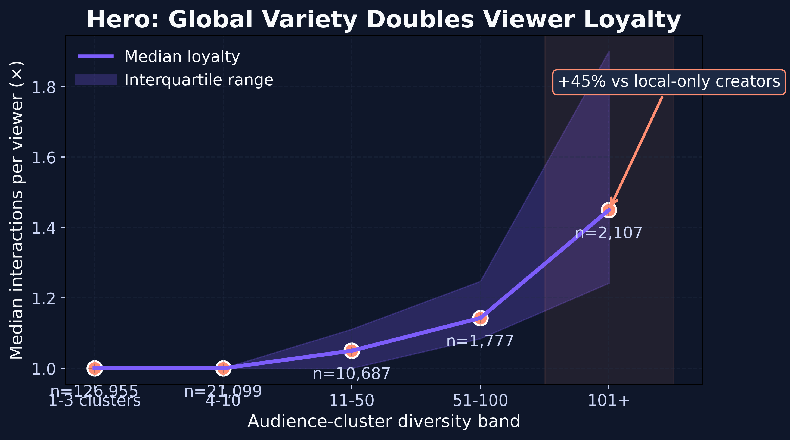
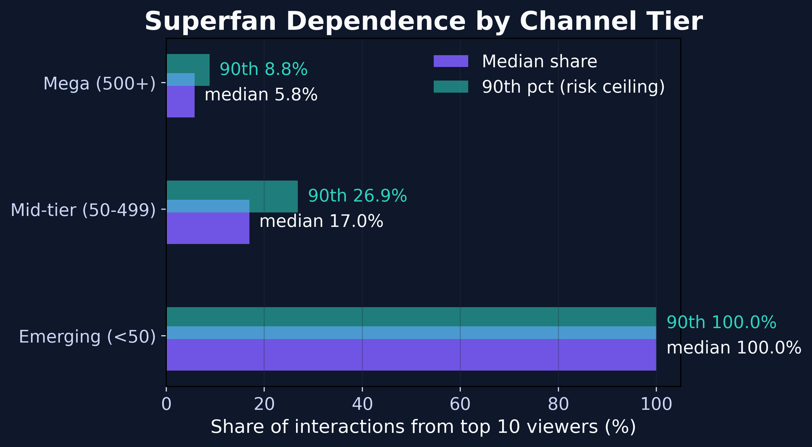
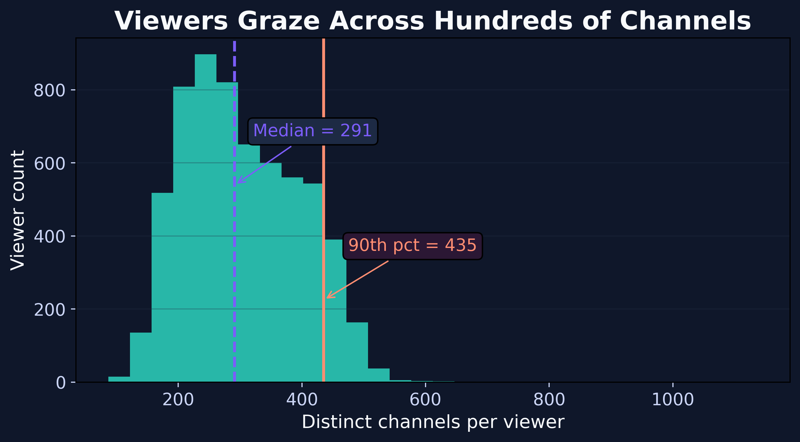
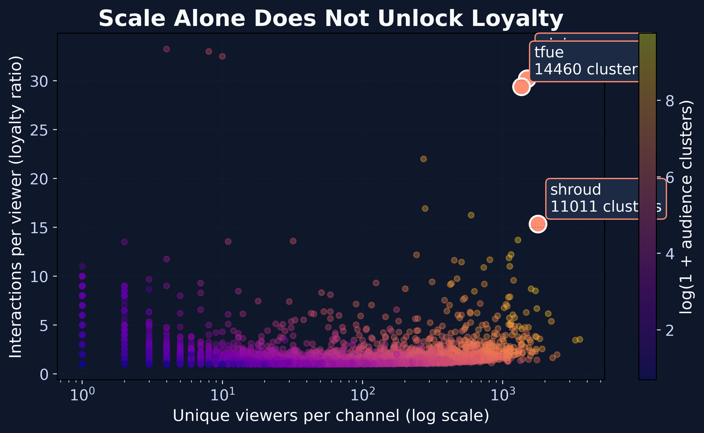

# Loyalty Loop: Twitch Audience Diversity Story

## Project Overview
This project is my Codédex February 2026 Dataset Challenge submission. It digs into 3,051,733 Twitch streamer interactions to answer a deceptively simple question: *what really makes viewers come back?* By pairing a reproducible pipeline with publication-ready visuals, we uncover how global variety multiplies loyalty.

## Dataset Source
- **Twitch Streamers Data** – 

Due to GitHub’s 100MB file size limit, the original raw dataset is not stored directly in this repository.

The dataset used in this analysis can be downloaded from:

[https://www.kaggle.com/datasets/volodymyrpivoshenko/twitch-live-streaming-interactions-dataset]

After downloading, place the file inside:

data/raw/

Then run:

python clean_data.py

This will generate the cleaned dataset required for the analysis.

## Repository Structure
```
.
├── data/
│   ├── raw/  # original CSV
│   └── cleaned.csv
├── figures/  # exported PNGs + coin badge
├── notebook/twitch_loyalty_story.ipynb
├── reports/
│   ├── data_cleaning_report.md
│   ├── submission_story.md
│   └── slides_outline.md
├── pipeline.py
├── README.md
└── requirements.txt
```

## How to Run
1. **Set up environment**
   ```bash
   python3 -m venv .venv
   source .venv/bin/activate
   pip install -r requirements.txt
   ```
2. **Reproduce cleaning + features**
   ```bash
   python pipeline.py
   ```
3. **Explore + regenerate visuals** – open the notebook or re-run the plotting script section inside it to refresh the PNGs in `figures/`.

## Key Findings
- **Hero insight:** Channels reaching **100+ audience clusters** see a **45% jump in median loyalty** (repeat interactions per viewer) compared with creators stuck in ≤3 clusters.
- **Superfan risk:** Mid-tier streamers still rely on just **10 viewers for ~50%** of engagement, whereas mega channels diversify their fanbases.
- **Viewer fragmentation:** The median viewer interacts with **291 distinct channels**, so creators compete with ~300 alternatives every time they go live.

## Visual Highlights





## Limitations
- The dataset captures a slice of 2025 Twitch behavior; it does not include monetization or genre metadata, so we approximate loyalty via interactions per viewer.
- Audience “clusters” are inferred IDs, not explicitly labeled locales—future work could enrich them with actual geography or language tags.
- Viewer privacy protections mean we cannot tie behavior to actual watch minutes; insights rely on interaction ranks as a proxy for loyalty.
